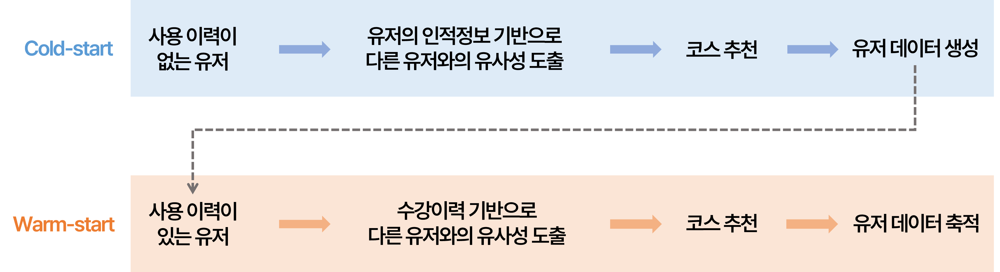

# **다감각 학습 코스 추천시스템**

## **I.** Intro
### Objective
기존 다감각 프로그램의 학습 코스 (i.e. Subject & Level) 선택은 지도사가 아이의 발달 상황과 흥미도를 종합적으로 고려하여 선택했다.  
학습 코스 선택을 자동화하는 추천시스템을 개발하는 것이 이 프로젝트의 목표이다.

### Overview
사용 이력이 있는 Warm-start 유저의 경우, 학습한 코스의 성취도를 기반으로 User-based Collaborative Filtering을 진행한다.  

사용 이력이 없는 Cold-start 유저의 경우, 유사한 인적 정보를 가진 유저를 찾고, 해당 유저가 학습한 코스의 성취도를 고려하여 학습 코스를 추천한다.   

두 개의 모델이 독립적으로 구동되지만, Fusion을 통해서 Cold-user가 Warm-user로 바뀌는 경우를 유기적으로 처리하도록 했다.  




## **II.** Architecture Details

Model에 대한 구현은 `fusion/model/coldstart` or `fusion/model/warmstart` 에 있다.

### Cold-start

#### **`similarity.py`**  

- `class Similarity` : 유저 사이의 [Cosine Similarity](https://scikit-learn.org/stable/modules/generated/sklearn.metrics.pairwise.cosine_similarity.html) 행렬을 구한다.

#### **`predict.py`**  

- `topk()` : 유저 사이의 유사도와 해당 유저의 코스 별 성취도를 곱한 값을 기준으로 k개 아이템의 랭킹을 반환한다.
- `recommend()` : 랭킹을 subject, level 데이터로 변환한다.

#### Example

```python
cold_user_name: str = ...  # Let it be Given!
similarity = Similarity(
    warms_user_info, colds_user_info, scaler=StandardScaler()
)
similar_users = similarity.similar_users(cold_user_name)

# Score and Rank courses which was learned by similar_users
courses_ranking = model.coldstart.predict.topk(
    similar_users, warms, user_table, K
)

echo.display_leader_board(
    courses_ranking, f" Leader board for cold-start user, {cold_user_name}"
)

# Convert ranking to subject, level data for recommendation
recommended_courses = model.coldstart.predict.recommend(courses_ranking, curriculum)
echo.display_courses(recommended_courses)
```

### Warm-start

#### **`loader`**  
- `{your_model_name}.pt` : 학습한 모델을 설정한 경로에 `.pt` 형식으로 저장한 파일이다.

#### **`network.py`**  
- `class GMF(nn.Module)` : Generalized Matrix Factorization 구현
- `class MLP(nn.Module)` : Multi-Layers Perceptron 구현
- `class NCF(nn.Module)` : [Neural Collaborative Filtering (IWWWC 2017)](https://arxiv.org/pdf/1708.05031.pdf) 구현. GMF, MLP의 ensemble이다.

#### **`predict.py`**  
- `topk()` : 유저 사이의 학습 이력을 기반으로 유사도를 도출하고 이를 기준으로 k개 아이템의 랭킹을 반환한다. 이 때 이미 학습한 코스와 그렇지 않은 코스를 따로 반환한다.
- `recommend()` : 랭킹을 subject, level 데이터도 변환한다.
- `reate_model_path()` : `loader` 디렉토리에 저장할 모델 이름을 설정한다.

#### **`train.py`**
- `generate()` : model instance를 만들어준다.
- `fit()` : model을 주어진 하이퍼파라미터와 데이터를 기반으로 학습한다.


#### Example
```python
# Load or Save model
ncf_model = generate(
    model_class=NCF, 
    params=PARAMS,
    user_ids=user_ids, 
    item_ids=item_ids
)

# Train
ncf_model = fit(
    model=ncf_model, 
    params=PARAMS, 
    user_ids=user_ids, 
    item_ids=item_ids, 
    ratings=ratings
)

# And save it
model_path = model.warmstart.predict.create_model_path(LOAD_FOLDER, LOAD_NAME)
torch.save(ncf_model.state_dict(), model_path)

# Inference
covered_ranking, uncovered_ranking = model.warmstart.predict.topk(
    warms, ncf_model, target_user_id, all_courses, K
)
echo.display_leader_board(
    covered_ranking, title=f"Covered Courses Leader-board for {target_user}({target_user_id})"
)

echo.display_leader_board(
    uncovered_ranking, title=f"Uncovered Courses Leader-board for {target_user}({target_user_id})"
)

topK_not_in_history = model.warmstart.predict.recommend(curriculum, uncovered_ranking)
echo.display_courses(topK_not_in_history)
```

### Deeper into *Fusion*
Cold-user가 학습을 하나 완료하면 Warm-user로 바꾸어야 한다.  
`model/coldstart/similarity.py`에 선언한 `class Similarity`의 클래스 메서드에서 아래의 함수가 이 작업을 해준다.
-  `__add_row_to_csv()` : 판다스에서 첫번째 row를 csv 마지막에 추가한다.
- `append_cold_user()` : 새로운 Cold-user 한 명을 추가한다. 실시간 추천시스템을 위해 구현해둔 것이다.
- `cvt_cold_to_warm()` : Cold-user를 Warm-user로 바꾸고, 관련된 내부 자료구조와 csv 파일을 갱신한다.

## III. Insider data managing
model은 Cold-user, Warm-user의 정보와 다감각 학습 커리큘럼 전체에 대한 정보를 기반으로 동작한다.  
해당 데이터들을 내부적으로 처리하는 logic은 다음과 같다.

#### `config.py`  
아래와 같은 정보를 모델 사용 시에 custom할 수 있다.
- 커리큘럼의 subject, level 구성 정보
- 환경 변수 (경로 지정)
- 모델 하이퍼파라미터  

#### `schema.py`
- `class Curriculum` : 학습 커리큘럼의 모든 데이터를 정수형으로 encoding하고 해당 mapping table을 관리한다.
- `class UserTable` : 문자열 유저 이름을 정수형으로 encoding하고 해당 mapping table을 관리한다.
- `preprocess()` : 위 두가지 클래스 인스턴스를 기반으로 적절히 전처리한 학습 데이터셋을 반환한다.

## IV. Miscellaneous

#### `echo.py`
- 시스템 메세지 출력을 위한 데코레이터와 함수를 구현했다.

#### `main.py`
- 기본적인 모델 실행을 테스트 해보기 위한 main 함수를 구현했다.
- Fusion에 대한 테스트 코드는 구현하지 않았다. 단순히 Concatenate한 상태이다.

#### `sampling.py`
- 현재 데이터가 존재하지 않기에, 모델 구현 및 테스트를 위한 임의의 데이터를 생성하는 함수를 구현헀다.
- `python sampling.py`로 실행하면 샘플링이 작동한다.

## V. Environment Set-up

### Step1. Download this model
Use `git clone` or directly download.
Then you can get a below model hierarchy.
```
recsys
├── __pycache__
├── data
├── image
├── model
│   ├── coldstart
│   └── warmstart
├── config.py
├── echo.py
├── main.py
├── README.md
├── requirements.txt
├── sampling.py
└── schema.py
```


### Step2. Create anaconda virtual environment
```
(base) ~/recsys> conda create -n env_name
(base) ~/recsys> conda activate env_name
(env_name) ~/recsys> conda install python=3.10.13
(env_name) ~/recsys> pip install -r requirements.txt
```

### Step3. Run & test

#### 1) Base mode
```
(env_name) ~/recsys> python main.py
```
Then trained ncf model is saved at ./recsys/model/warmstart/loader as `.pt` file.

#### 2) Load mode
```
(env_name) ~/recsys> python main.py --load model_name.pt
```

#### 3) New data sampling __*only if you need*__
```
(env_name) ~/recsys> python sampling.py
```

## VI. Requirements
```
python=3.10.13
torch=2.2.0
numpy=1.26.3
pandas=2.1.4
matplotlib=3.8.0
scikit-learn=1.4.0
tqdm=4.66.2
```
